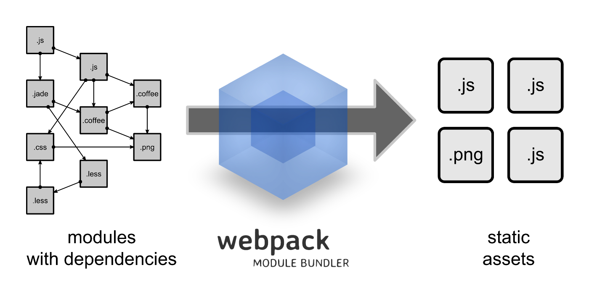
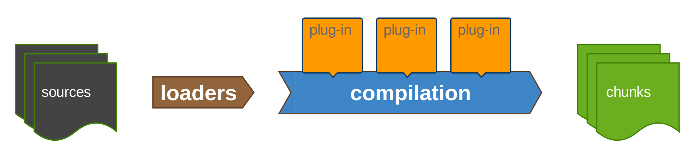

### Introduction to webpack
------
Using webpack to package your web apps for production

https://github.com/webpack

------
github.com/vmlf01

### what is webpack?
------
- module bundler, compile-time tool

- transforms javascript modules with dependencies into static assets

- created by Tobias Koppers aka @sokra, Germany, sometime around 2012
- 1.0.0 released 19 Feb 2014

### motivation
------
- better support for big single page applications using code splitting
- takes advantage of split points to divide assets into chunks that are loaded on demand

- we define the split points in code
- webpack takes care of chunking and loading

but...

that's for another presentation

:(

this one is just an introduction, so I'll show you a few simple samples to get you started

### main contents
------
- bundler (npm install devpack)

- development web server (npm install devpack-dev-server)
  - serves static files and bundle

  - supports hot module replacement

  - page reload when that is not possible

### architecture
------

how I picture it:

### sources/dependencies
------
- webpack compilation starts with specified entry files

- identifies the dependencies in each file recursively

- dependencies can be other code files or other asset types

### loaders
------
- each identified file is handled by one or more loaders

- loaders are like converters that transform source files into webpack modules

- you can chain them, sort of like streams

- there are a lot of them!

- https://webpack.github.io/docs/list-of-loaders.html

### plug-ins
------
- plug-ins are components that can react to each step of the compilation

- allow you to customize the build process

- ex: BannerPlugin, add a banner to the top of each generated chunk, like legal notices, etc.

### chunks
------
- final artifacts of the bundler

- code chunks can be of three different types:
  - entry chunk - contains webpack runtime

  - initial chunk - is loaded when application starts

  - normal chunk

### settings and configuration
------
- CLI/inline

- webpack.config.js (recommended)

### samples
------
## simple static site

### samples
------
## static site with src/dist folders

###samples
------
## angular.js site

### links
------
- https://github.com/webpack

- https://github.com/petehunt/webpack-howto

- https://unindented.github.io/webpack-presentation/

- http://dontkry.com/posts/code/single-page-modules-with-webpack.html

# questions?

# thank you!

github.com/vmlf01

vmlf01@gmail.com
